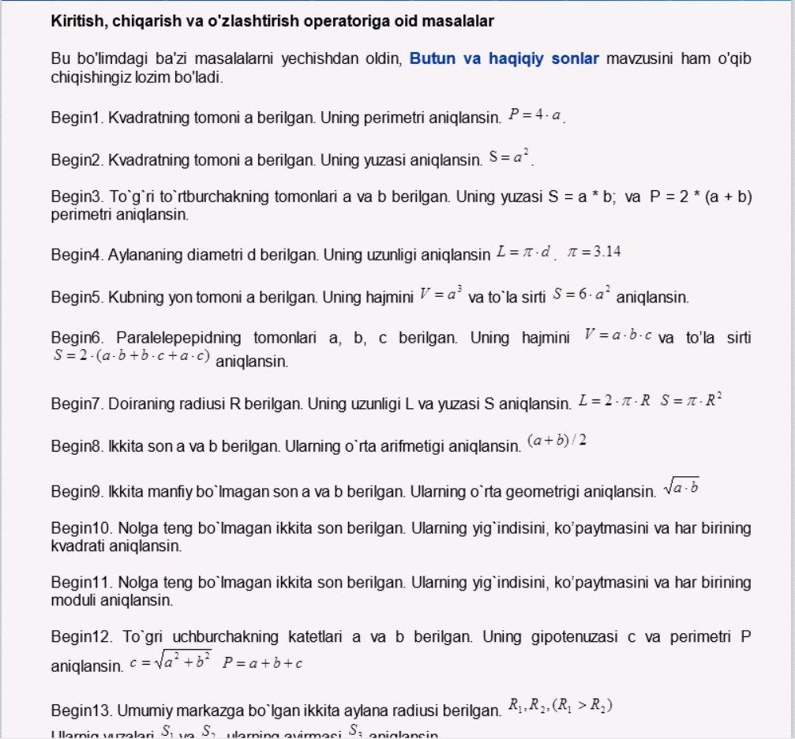
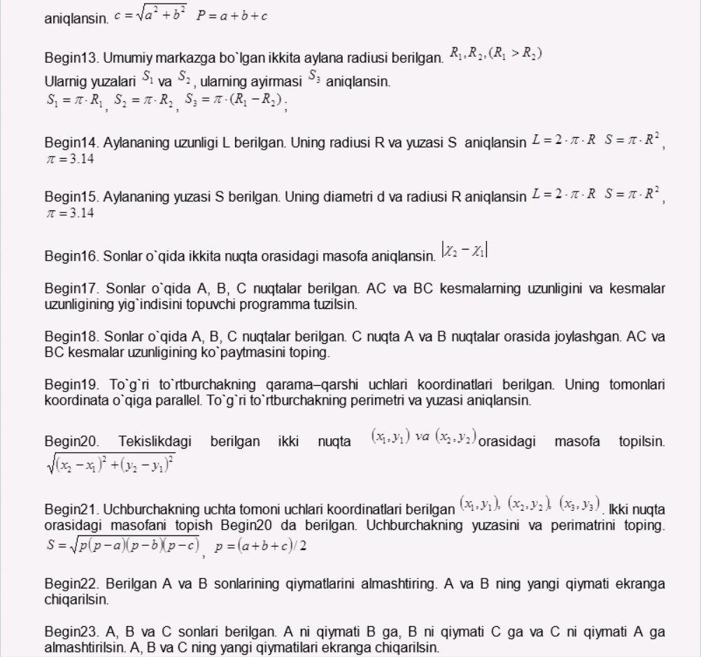

## Interview Questions + Solutions

### Questions List
<div>
  
  
  
</div>

<br />

### Installation

Git clone

```bash
git clone https://github.com/GulomjonBakirov/interviewQuestions.git
cd client
npm install
```

### Run code

```bash
yarn start
```

### Demo View

[InterviewSolutions](https://bakirovinterviewsolution.netlify.app/)

